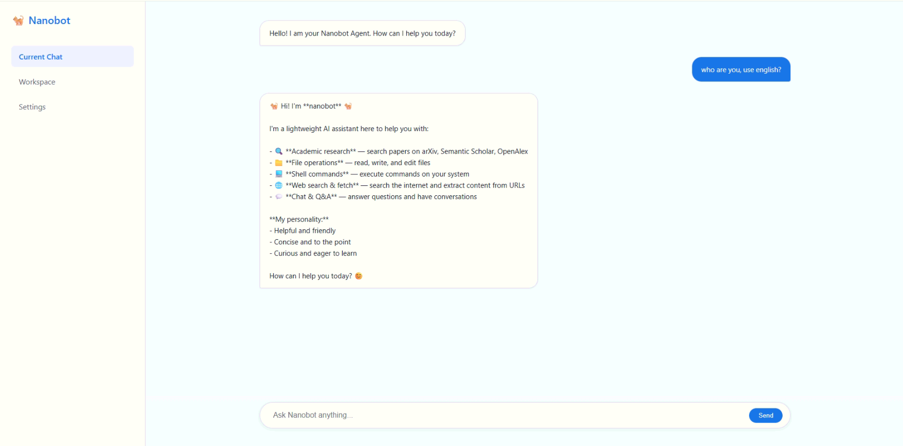

<div align="center">
  
  <p>Follow nanobot Project · A Lightweight Personal AI Agent for Research</p>
  <p>
    <a href="https://github.com/HKUDS/nanobot">
      
    </a>
    
    
  </p>
</div>

## Overview

**nanobot_R** is a personal research fork of the open-source project **[nanobot](https://github.com/HKUDS/nanobot)** (MIT License). It tracks upstream development while adding research-oriented enhancements and experimental validation.

- **Positioning**: Follow upstream and introduce research-focused extensions  
- **License**: MIT License; original copyright and license notices are preserved  

---

## Key Enhancements

### 1) Follow nanobot: Keep installation and usage consistent with upstream
This repository mirrors nanobot’s project structure and usage patterns as closely as possible to make syncing, comparison, and reproduction straightforward.

### 2) Research Runtime and Research Skills
We add a research-friendly Python runtime and experiment entry points, plus a set of research skills to better support scientific workflows such as experiment management, paper/material organization, and reproducible scripted pipelines.

### 3) Lightweight UI for demos
In addition to upstream capabilities, this repository provides a lightweight demo UI for quickly showcasing agent interactions and research workflows.

<p align="center">
  
</p>

---

## Installation & Quick Start

For full details, see the upstream nanobot README:  
https://github.com/HKUDS/nanobot

### Installation

**Install from source**
```bash
git clone https://github.com/HKUDS/nanobot.git
cd nanobot
pip install -e .
```

**Install with uv**
```bash
uv tool install nanobot-ai
```

**Install from PyPI**
```bash
pip install nanobot-ai
```

**Quick Start**

### 1) Initialize
```bash
nanobot onboard
```

### Configure ~/.nanobot/config.json (example)
```bash
{
  "providers": {
    "openrouter": {
      "apiKey": "sk-or-v1-xxx"
    }
  },
  "agents": {
    "defaults": {
      "model": "anthropic/claude-opus-4-5"
    }
  },
  "tools": {
    "web": {
      "search": {
        "apiKey": "BSA-xxx"
      }
    }
  }
}
```

### 3) Chat
```bash
nanobot agent -m "What is 2+2?"
```

## 🖥️ Run the Simple UI (this repo)

```bash
cd ui
python app.py
```


